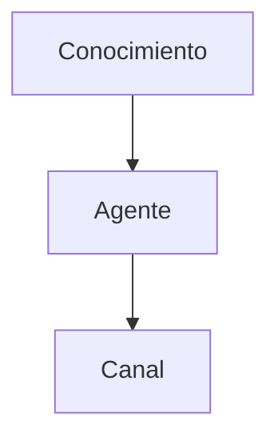

# Documentación de Consul Point

Documentación oficial de la plataforma **Consul Point**, construida con [Docusaurus](https://docusaurus.io/).

🌐 **Sitio publicado:** https://akui-solutions.github.io/consul-point-docs

---

## Requisitos

- Node.js 20 o superior
- pnpm ([instálalo](https://pnpm.io/installation) con `npm install -g pnpm` o `brew install pnpm`)

## Puesta en marcha

```bash
pnpm install
pnpm start
```

El sitio queda disponible en `http://localhost:3000` y se recarga automáticamente al guardar cambios.

## Comandos

| Comando | Función |
|---|---|
| `pnpm start` | Servidor de desarrollo con recarga en caliente |
| `pnpm run build` | Genera el sitio estático en `build/` |
| `pnpm run serve` | Sirve localmente el sitio ya construido |
| `pnpm run clear` | Limpia la caché de Docusaurus |

---

## Cómo editar la documentación

Todo el contenido vive en `docs/`, en archivos Markdown. Para editar una página, basta con modificar su archivo.

### Estructura

```
docs/
├── intro.md                  # Portada
├── introduccion/             # Visión general, conceptos, navegación
├── modulos-principales/      # Estudio, Conocimiento, Conversaciones...
├── organizacion/             # Espacios de trabajo, usuarios y roles...
├── control/                  # Auditoría, configuración, webhooks
└── referencia/               # Campos, permisos, glosario
```

### Cabecera de cada archivo

Cada página empieza con un bloque de metadatos:

```markdown
---
id: estudio
title: Estudio
sidebar_label: Estudio
sidebar_position: 1
description: Descripción que aparece en buscadores.
---
```

- `sidebar_position` determina el orden dentro de su sección.
- `description` mejora el posicionamiento en Google.

### Añadir una página nueva

1. Crea el archivo `.md` en la carpeta que corresponda.
2. Añade la cabecera de metadatos.
3. Registra su ruta en `sidebars.ts` para que aparezca en el menú lateral.

### Bloques destacados

Docusaurus incluye avisos con estilo propio:

```markdown
:::tip Consejo
Recomendaciones y buenas prácticas.
:::

:::info Información
Contexto adicional relevante.
:::

:::warning Advertencia
Restricciones y comportamientos no obvios.
:::

:::danger Atención
Acciones irreversibles o de riesgo.
:::
```

### Diagramas

Se admite [Mermaid](https://mermaid.js.org/) directamente:

````markdown

````

---

## Flujo de trabajo

1. Crea una rama desde `main`.
2. Haz tus cambios en `docs/`.
3. Comprueba en local con `pnpm start`.
4. Abre un Pull Request. Se verifica automáticamente que el sitio construya.
5. Al fusionar en `main`, el sitio se despliega solo.

---

## Despliegue

El despliegue es automático mediante GitHub Actions al hacer push a `main`.

**Configuración necesaria (una sola vez):** en *Settings → Pages* del repositorio, seleccionar **GitHub Actions** como origen.

### Dominio propio

Para publicar en un dominio como `docs.consulpoint.com`:

1. Añade un archivo `static/CNAME` con el dominio.
2. En `docusaurus.config.ts`, cambia `url` al dominio y `baseUrl` a `'/'`.
3. Configura el DNS apuntando a GitHub Pages.

---

## Búsqueda

El sitio está preparado para [Algolia DocSearch](https://docsearch.algolia.com/apply/), gratuito para documentación pública. Una vez aprobada la solicitud, descomenta el bloque `algolia` en `docusaurus.config.ts` con las credenciales recibidas.

---

## Idiomas

El sitio está configurado en español. Para añadir inglés:

1. Añade `'en'` al array `locales` en `docusaurus.config.ts`.
2. Ejecuta `pnpm run write-translations -- --locale en`.
3. Traduce el contenido en `i18n/en/`.

---

*Akui Solutions · Consul Point*
