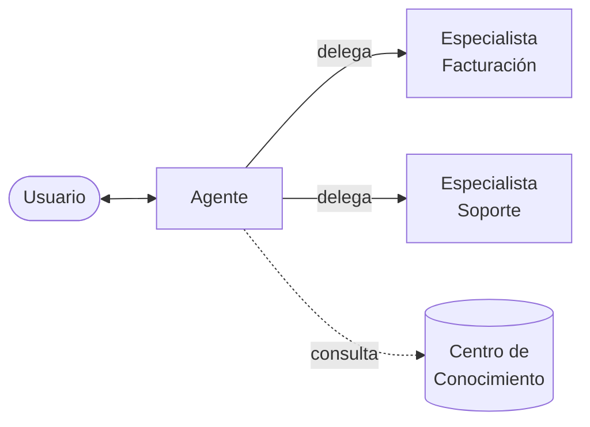

# Agentes

El **Agente** es el asistente principal. Conversa con personas a través de [Conversaciones](/modulos/conversaciones) o de un canal conectado. Es el único tipo que puede invocar [Especialistas](/control/estudio/especialistas).

**Casos de uso:** atención al cliente, soporte, consulta interna de documentación.

## Creación

Un Agente se crea desde el Estudio siguiendo el formulario general de tres pasos: información básica, respuestas y personalización, y documentos. Consulta el detalle completo en [Crear un agente](/modulos/estudio#crear-un-agente).

:::danger El tipo de agente es inmutable
El tipo se define en el primer paso y **no puede modificarse después de crear el agente**.
:::
