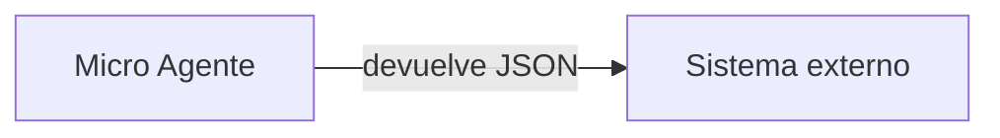

# Microagentes

Un **Micro Agente** ejecuta una instrucción predefinida y devuelve el resultado conforme a un esquema JSON definido por el usuario. No mantiene conversación.

**Casos de uso:** extraer campos normalizados de documentos o correos para su procesamiento por otro sistema.

## Campos requeridos

| Campo | Descripción | Límite |
|---|---|---|
| **Instrucción de ejecución** | La orden que se ejecuta al invocarlo | Máx. 5.000 caracteres |
| **Esquema de respuesta** | Objeto JSON válido con las propiedades esperadas | — |
| **Ejemplo del esquema** | Ejemplo del objeto de respuesta | Obligatorio |

El esquema de respuesta y su ejemplo se definen con el mismo criterio que cualquier otro esquema de datos de la plataforma — ver [Esquemas de datos](/control/estudio/esquemas-de-datos).

Para el resto del formulario de creación (información básica y documentos), ver [Crear un agente](/modulos/estudio#crear-un-agente).
