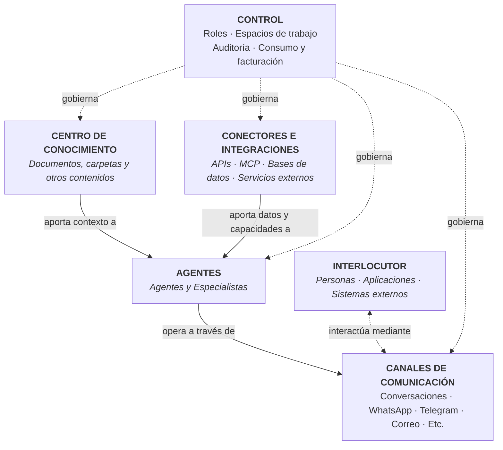
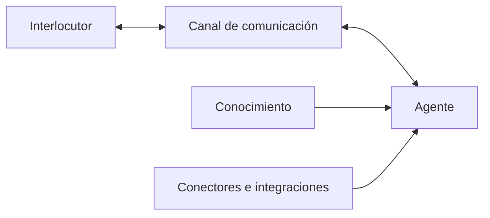
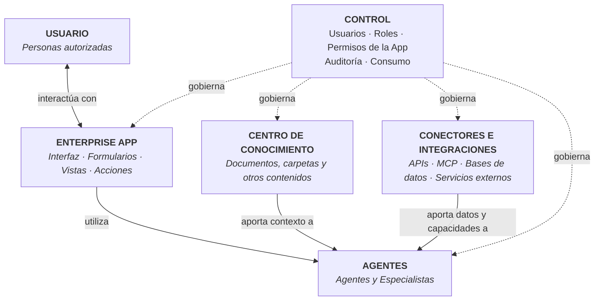
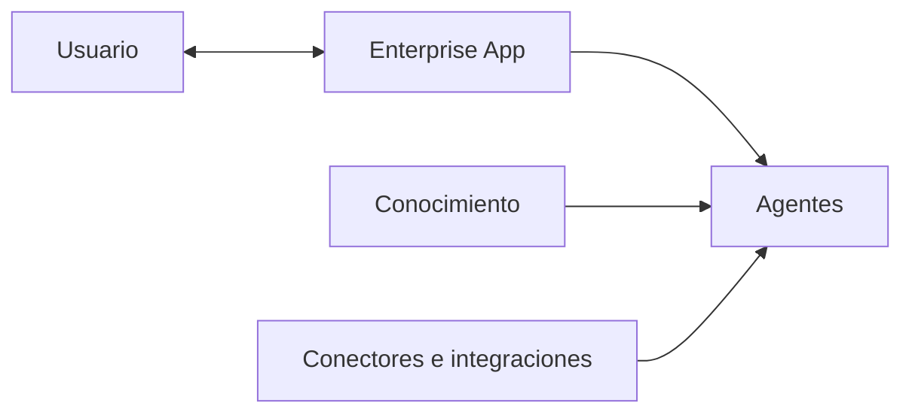

# Visión general de la plataforma

**ConsulPoint** es una **plataforma empresarial de inteligencia artificial** diseñada para centralizar conocimiento, desplegar agentes y asistentes, conectar canales de comunicación, integrar aplicaciones y sistemas externos, y automatizar procesos dentro de un entorno gobernado.

La plataforma permite que la IA trabaje con el contexto real de una organización: documentación, datos, conversaciones, herramientas internas y sistemas corporativos. A partir de ese contexto, ConsulPoint puede responder consultas, asistir a empleados y clientes, ejecutar tareas, interactuar con otros sistemas y coordinar procesos de forma controlada.

Su arquitectura es modular. Cada capacidad puede utilizarse de forma independiente, pero el mayor valor aparece cuando **conocimiento, agentes, canales de comunicación, Enterprise Apps, conectores, integraciones y automatizaciones** trabajan de forma conjunta bajo un mismo modelo de permisos, trazabilidad, supervisión y control.

## CONVERSACIONES - Arquitectura funcional

ConsulPoint se organiza en varios elementos funcionales que trabajan de forma coordinada. La capa de control actúa de forma transversal sobre el resto de la plataforma.



El **conocimiento** proporciona a los agentes información específica de la organización.

Los **agentes** utilizan ese conocimiento, junto con sus instrucciones y capacidades, para responder, razonar o ejecutar tareas.

Los **conectores e integraciones** permiten a los agentes consultar información y ejecutar acciones sobre sistemas externos, como aplicaciones empresariales, bases de datos, servicios web o herramientas de terceros, mediante mecanismos como APIs o MCP.

Los **canales de comunicación** son los medios a través de los cuales los agentes interactúan con personas, aplicaciones o sistemas externos.

El **interlocutor** es la persona, aplicación o sistema que inicia una interacción con ConsulPoint o recibe el resultado de ella.

La **capa de control** define cómo se accede y utiliza cada recurso mediante roles, espacios de trabajo, auditoría y control de consumo.

Un agente puede funcionar sin conocimiento vinculado o sin integraciones externas. En esos casos, operará únicamente con sus instrucciones y con las capacidades disponibles en el modelo configurado.

Como regla general, para configurar un nuevo caso de uso se recomienda seguir este esquema:



La **capa de control** actúa de forma transversal sobre todos los elementos del sistema.

## CONVERSACIONES - Qué permite hacer

ConsulPoint permite construir y operar casos de uso de inteligencia artificial sobre el conocimiento, los sistemas y los canales reales de una organización.

La plataforma permite, entre otras capacidades:

- crear asistentes internos y externos apoyados en información propia de la organización;
- atender consultas a través de canales como conversaciones, WhatsApp, Telegram, correo u otros medios integrados;
- conectar agentes con aplicaciones, bases de datos y servicios externos mediante APIs, MCP y otros mecanismos de integración;
- consultar información de sistemas corporativos y utilizarla durante una conversación o proceso;
- ejecutar acciones sobre herramientas externas cuando el agente dispone de las capacidades y permisos necesarios;
- crear agentes especializados para áreas, procesos o funciones concretas;
- analizar mensajes, documentos y otros contenidos para clasificar información, extraer datos o generar respuestas;
- combinar conocimiento, agentes, conectores y canales dentro de un mismo caso de uso;
- mantener supervisión, trazabilidad y control sobre el uso de la inteligencia artificial dentro de la organización.

ConsulPoint no está limitado a un único tipo de asistente o canal. Sus distintos componentes pueden combinarse para adaptarse a procesos internos, atención a clientes, gestión operativa, consulta de información o interacción con sistemas corporativos.

## APPs - Arquitectura funcional

Las **Enterprise Apps** permiten construir aplicaciones empresariales que utilizan las capacidades de ConsulPoint dentro de una interfaz específica para cada caso de uso.

A diferencia del modelo de conversaciones, donde el interlocutor interactúa con un agente a través de un canal de comunicación, en una App el usuario interactúa directamente con una **interfaz de aplicación**, que puede utilizar agentes, conocimiento y conectores de ConsulPoint.

La capa de control actúa de forma transversal sobre todos estos elementos.



La **Enterprise App** proporciona la interfaz y la experiencia específica del caso de uso.

Los **agentes** pueden aportar inteligencia a la aplicación para interpretar información, responder, analizar, decidir o ejecutar tareas.

El **conocimiento** proporciona a los agentes información propia de la organización.

Los **conectores e integraciones** permiten consultar información o ejecutar acciones sobre aplicaciones, bases de datos y servicios externos.

El **usuario** interactúa con la aplicación dentro de los permisos que tenga asignados.

La **capa de control** determina qué recursos y capacidades puede utilizar cada aplicación y cada usuario.

Los permisos efectivos de una App dependen de la combinación de los permisos del usuario, los permisos concedidos a la propia aplicación y las políticas establecidas por la organización.

De forma conceptual:

```text
Permisos efectivos =
Permisos del usuario
∩ Permisos de la App
∩ Políticas de la organización
```

Una App no necesita utilizar necesariamente todas las capacidades disponibles. Puede resolver un caso de uso sencillo mediante una interfaz específica o combinar agentes, conocimiento e integraciones cuando el proceso lo requiera.

Como esquema general:



La **capa de control** actúa de forma transversal sobre todos los elementos del sistema.

## APPs - Qué permite hacer

ConsulPoint Enterprise Apps permite crear aplicaciones específicas para procesos empresariales utilizando las capacidades comunes de ConsulPoint.

La plataforma permite, entre otras capacidades:

- crear aplicaciones con una interfaz específica para un proceso o necesidad concreta;

- utilizar agentes de inteligencia artificial dentro de una aplicación sin limitar la interacción a una conversación tradicional;

- utilizar conocimiento corporativo como contexto para las funciones de inteligencia artificial de la aplicación;

- conectar las aplicaciones con APIs, MCP, bases de datos y servicios externos;

- consultar información procedente de sistemas corporativos;

- ejecutar acciones sobre sistemas externos cuando la aplicación, el agente y el usuario disponen de los permisos necesarios;

- crear formularios, vistas, herramientas y acciones adaptadas al proceso que se quiere resolver;

- combinar interfaz, inteligencia artificial, conocimiento e integraciones dentro de una única aplicación;

- controlar qué capacidades puede utilizar cada App;

- mantener permisos, auditoría, trazabilidad y control de consumo sobre su utilización.

Las Enterprise Apps permiten utilizar ConsulPoint más allá de la interfaz conversacional.

Mientras que en **Conversaciones** el agente constituye normalmente el centro de la interacción, en **Enterprise Apps** el usuario trabaja con una aplicación diseñada para una tarea concreta y la inteligencia artificial pasa a formar parte de las capacidades internas de esa aplicación.

El principio general es:

**la App proporciona la experiencia de usuario; ConsulPoint proporciona la inteligencia, el conocimiento, las integraciones y el control.**

## Aislamiento de datos

La **organización** es el ámbito principal de aislamiento, administración y control dentro de ConsulPoint.

Todos los recursos creados o gestionados en la plataforma pertenecen a una organización concreta. Esto incluye, entre otros:

- usuarios;
- documentos y conocimiento;
- agentes y especialistas;
- conversaciones;
- Enterprise Apps;
- conectores e integraciones;
- configuraciones;
- espacios de trabajo;
- registros de auditoría.

Los recursos de una organización no forman parte del entorno de otras organizaciones.

Dentro de una misma organización, el acceso a la información y a las capacidades puede restringirse adicionalmente mediante roles, permisos, espacios de trabajo y los permisos asignados a cada recurso.

En el caso de las **Enterprise Apps**, el acceso efectivo depende además de las capacidades autorizadas para la propia aplicación y de los permisos del usuario que la utiliza.

De forma conceptual:

```text
Acceso efectivo =
Permisos del usuario
∩ Permisos del recurso o aplicación
∩ Políticas de la organización
```
