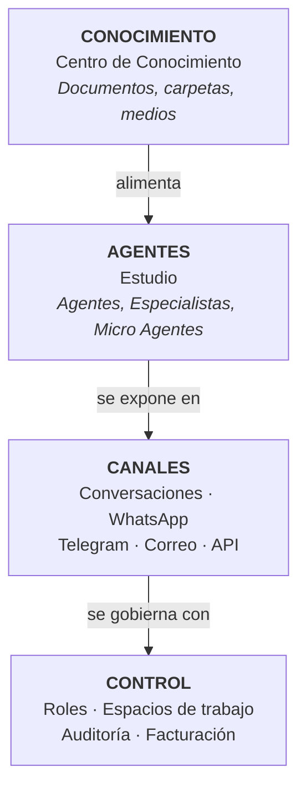

# Visión general de la plataforma

Consul Point es una plataforma de agentes de inteligencia artificial empresarial. Permite a una organización crear asistentes de IA que operan sobre su propia documentación, se conectan a canales de comunicación reales y funcionan bajo supervisión humana y control de consumo.

## Arquitectura funcional

La plataforma se estructura en cuatro capas. Comprender esta relación es la clave para usarla correctamente.

:::info Regla de dependencia
Un agente sin conocimiento vinculado responde de forma genérica. Un canal sin agente asignado no responde. El orden de configuración recomendado es siempre **conocimiento → agente → canal**.
:::

## Qué permite hacer

- Asistentes que responden a clientes en WhatsApp con información real de la organización.
- Asistentes internos que resuelven consultas sobre procedimientos y documentación corporativa.
- Agentes que consultan disponibilidad de calendario y agendan citas.
- Bandejas de correo que clasifican mensajes y extraen datos de sus adjuntos automáticamente.

## Aislamiento de datos

Todos los datos —documentos, agentes, usuarios, conversaciones— pertenecen a una **organización** y están aislados de las demás. La organización es la entidad contratante y el ámbito de seguridad de la plataforma.
