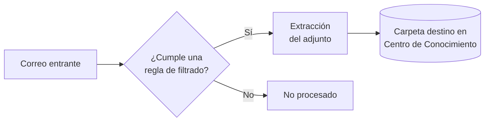

# Bandeja Inteligente

**Ruta:** `/smart-inbox`

## Descripción

Gestión del correo corporativo con procesamiento automático de adjuntos. Requiere una integración de correo configurada (Gmail, Microsoft o IMAP).

:::info Distinción entre módulos
La Bandeja Inteligente gestiona **correo electrónico**. Las conversaciones de mensajería instantánea (WhatsApp, Telegram) se gestionan desde [Conversaciones](/modulos-principales/conversaciones).
:::

## Vistas

| Vista | Descripción |
|---|---|
| **Vista dividida** | Listado y contenido simultáneos |
| **Vista de lista** | Listado completo |

## Procesamiento de adjuntos

Cada mensaje presenta un estado de procesamiento:

| Estado | Significado |
|---|---|
| **Pendiente** | Requiere acción manual (sin adjunto) |
| **Extrayendo** | Procesamiento en curso |
| **Extraído** | Adjunto extraído a la carpeta destino |
| **Fallido** | Error durante el procesamiento |
| **No procesado** | Fuera del alcance de las reglas |

Los adjuntos procesados se depositan automáticamente en la carpeta configurada del [Centro de Conocimiento](/modulos-principales/centro-de-conocimiento).

## Filtrado

**Filtros disponibles:** búsqueda por texto, estado de procesamiento, rango de fechas, presencia de adjuntos, carpeta destino, remitente, destinatario, asunto, etiqueta, destacados y no leídos.

## Reglas de filtrado

**Ruta:** `/smart-inbox/filters`

Definen qué mensajes se procesan automáticamente y hacia qué carpeta se dirigen sus adjuntos. Admiten creación y edición.
