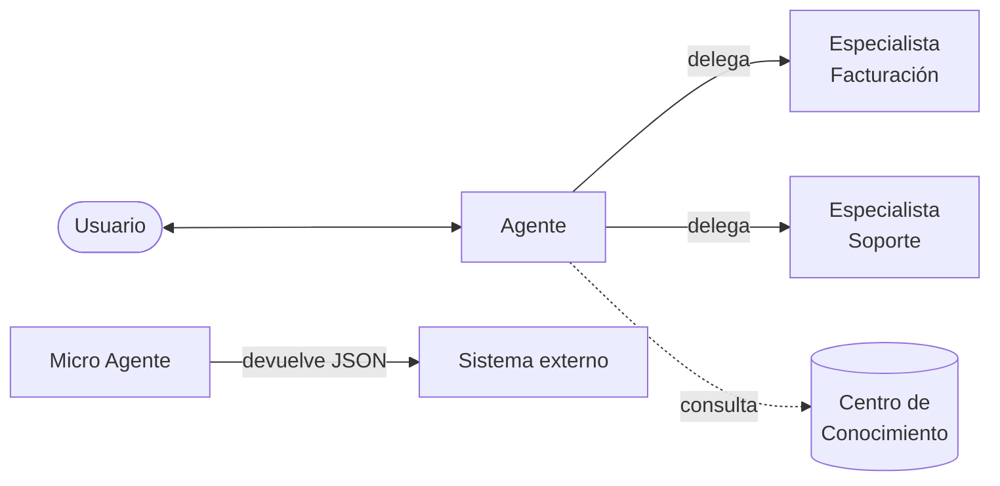

# Estudio

**Ruta:** `/studio`
**Permiso requerido:** lectura sobre el módulo Estudio

## Descripción

El Estudio es el módulo de creación y administración de agentes. Desde aquí se define qué agentes existen, cómo se comportan, qué conocimiento consultan y quién puede utilizarlos.

## Organización del módulo

La vista principal presenta tres pestañas, una por tipo de agente:

| Pestaña | Contenido |
|---|---|
| **Agentes** | Asistentes principales |
| **Especialistas** | Agentes auxiliares invocables |
| **Microagentes** | Agentes de extracción estructurada |

Cada listado muestra: nombre, modelo, estado, descripción, especialistas asociados y acciones. Dispone de filtros por **nombre** y por **modelo**.

## Tipos de agente



### Agente

El asistente principal. Conversa con personas a través de Conversaciones o de un canal conectado. Es el único tipo que puede invocar Especialistas.

**Casos de uso:** atención al cliente, soporte, consulta interna de documentación.

### Especialista

Un agente auxiliar al que un Agente principal delega consultas de un dominio concreto. El Agente decide cuándo invocarlo.

Requiere dos campos adicionales:

| Campo | Función | Límite |
|---|---|---|
| **Nombre técnico** | Identificador interno | Máx. 20 caracteres |
| **Descripción técnica** | Texto que el Agente principal evalúa para decidir la invocación | Obligatorio |

:::warning La descripción técnica no es documentación
Es el criterio de decisión que lee el Agente principal para determinar si activa al Especialista. Debe describir con precisión **cuándo** corresponde invocarlo, no qué hace en general.
:::

**Casos de uso:** un agente comercial que delega consultas de facturación en un especialista de facturación.

### Micro Agente

Ejecuta una instrucción predefinida y devuelve el resultado conforme a un **esquema JSON** definido por el usuario. No mantiene conversación.

Requiere:

- **Instrucción de ejecución**: la orden que se ejecuta al invocarlo (máx. 5.000 caracteres)
- **Esquema de respuesta**: objeto JSON válido con las propiedades esperadas
- **Ejemplo del esquema**: obligatorio

**Casos de uso:** extraer campos normalizados de documentos o correos para su procesamiento por otro sistema.

## Crear un agente

**Ruta:** `/studio/config/add-assistant`

El formulario se divide en tres pasos secuenciales.

:::danger El tipo de agente es inmutable
El tipo se define en el primer paso y **no puede modificarse después de crear el agente**. Si se selecciona incorrectamente, es necesario crear un agente nuevo.
:::

### Paso 1 — Información básica

| Campo | Obligatorio | Restricciones |
|---|---|---|
| Tipo de agente | Sí | No modificable tras la creación |
| Nombre | Sí | 3–50 caracteres, sin caracteres especiales |
| Descripción | Sí | Máx. 300 caracteres |
| Categorías | Sí | Mínimo una |
| Imagen del agente | No | JPG, PNG o WEBP |

Para Especialistas se añaden los campos de información técnica descritos arriba.

:::tip Asistencia de IA en la creación
La plataforma puede generar y mejorar automáticamente el nombre, la descripción, la imagen, las instrucciones del sistema y los iniciadores de conversación. Resulta útil como punto de partida cuando no se tiene claro el planteamiento inicial.
:::

### Paso 2 — Respuestas y personalización

Define el comportamiento del agente.

#### Tono de comunicación

Estilo y actitud de las respuestas. **Máximo 3 tonos** simultáneos.

#### Instrucciones del sistema

Instrucciones permanentes que definen comportamiento y propósito. **Máximo 4.000 caracteres** (5.000 en Micro Agentes).

Es el parámetro de mayor impacto en la calidad del resultado. Estructura recomendada:

```text
[ROL]        Quién es el agente y a quién atiende.

[FUENTES]    De dónde debe extraer la información y qué
             hacer cuando no dispone del dato.

[ESTILO]     Registro, extensión y formato de respuesta.

[LÍMITES]    Qué no debe hacer y en qué casos derivar a
             una persona.
```

Ejemplo:

```text
Eres el asistente comercial de [Empresa]. Atiendes a clientes
que preguntan por nuestros productos y servicios.

Responde siempre a partir de la documentación disponible. Si un
dato no consta, indícalo explícitamente en lugar de deducirlo.

Utiliza un registro cordial y directo. Respuestas breves, sin
tecnicismos innecesarios.

No proporciones precios especiales, condiciones de descuento ni
resolución de reclamaciones: en esos casos, deriva a una persona
del equipo comercial.
```

#### Iniciadores de conversación

Frases sugeridas al usuario para iniciar la interacción.

| Restricción | Valor |
|---|---|
| Cantidad máxima | 5 |
| Longitud | 3–150 caracteres |

#### Capacidades

| Capacidad | Efecto |
|---|---|
| **Acceso al centro de conocimiento** | Habilita la consulta de los documentos vinculados |
| **Buscar en la web** | Permite obtener información actualizada de internet |
| **Generar imágenes** | Habilita la creación de imágenes con IA |
| **Texto a voz** | Convierte respuestas en audio |
| **Voz a texto** | Interpreta mensajes de audio |
| **Adjuntar archivos** | Permite al usuario enviar archivos para su procesamiento |
| **Fuentes certificadas** | Restringe a fuentes verificadas |

:::warning Dependencia entre capacidad y documentos
Sin la capacidad **Acceso al centro de conocimiento**, el agente no consultará los documentos vinculados en el paso 3, aunque estén correctamente asociados. Es la causa más frecuente de que un agente responda de forma genérica pese a tener documentación cargada.
:::

#### Modelo y configuración

| Parámetro | Descripción |
|---|---|
| **Modelo de procesamiento** | Proveedor de IA (OpenAI, Anthropic, Google) |
| **Modelo específico** | Modelo concreto del proveedor |
| **Embedding del core** | Modelo usado para vectorizar el conocimiento del agente |
| **Temperatura** | 0 = determinista y precisa · 1 = creativa y variada |

**Criterio de temperatura:**

| Rango | Uso recomendado |
|---|---|
| 0 – 0,3 | Atención al cliente, datos operativos, cumplimiento |
| 0,4 – 0,7 | Uso general, consulta interna |
| 0,8 – 1 | Generación creativa, redacción, ideación |

### Paso 3 — Documentos

Vincula las carpetas del Centro de Conocimiento que el agente puede consultar.

:::tip Alcance documental
Vincula únicamente las carpetas pertinentes a la función del agente. Un alcance documental amplio degrada la precisión de las respuestas y aumenta el consumo.
:::

## Detalle de un agente

**Ruta:** `/studio/assistant/details/general/:id`

| Pestaña | Contenido |
|---|---|
| **General** | Configuración del agente |
| **Especialistas** | Especialistas asociados |
| **Documentos** | Carpetas de conocimiento vinculadas |
| **Permisos** | Usuarios y roles con acceso |

## Permisos de un agente

Cada agente define quién puede utilizarlo. Con permisos personalizados debe indicarse **al menos un usuario**.

## Verificación

Tras crear o modificar un agente, se recomienda probarlo desde [Conversaciones](/modulos-principales/conversaciones) antes de exponerlo en un canal externo, comprobando mediante **Fuentes del mensaje** que responde a partir de la documentación vinculada.
