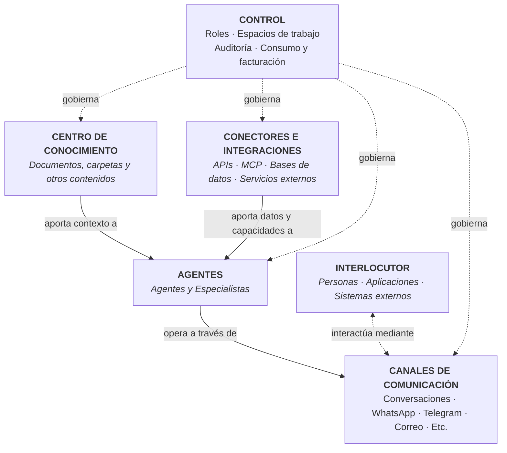
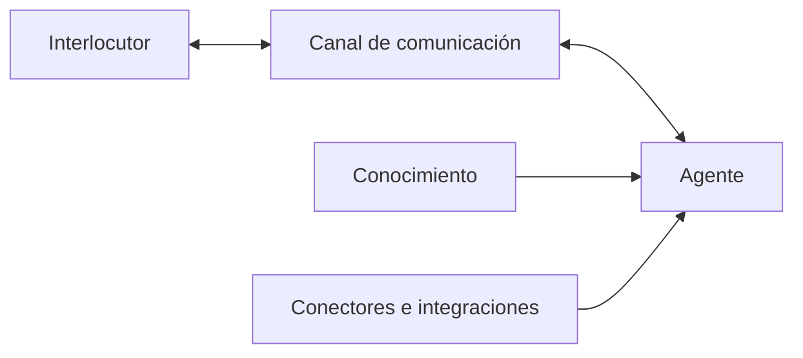

**Ruta:** `/conversations`

## Descripción

Interfaz de chat con los agentes de la organización. Es también el entorno de prueba recomendado antes de exponer un agente en un canal externo.

## Arquitectura funcional

ConsulPoint se organiza en varios elementos funcionales que trabajan de forma coordinada. La capa de control actúa de forma transversal sobre el resto de la plataforma.

El **conocimiento** proporciona a los agentes información específica de la organización.

Los **agentes** utilizan ese conocimiento, junto con sus instrucciones y capacidades, para responder, razonar o ejecutar tareas.

Los **conectores e integraciones** permiten a los agentes consultar información y ejecutar acciones sobre sistemas externos, como aplicaciones empresariales, bases de datos, servicios web o herramientas de terceros, mediante mecanismos como APIs o MCP.

Los **canales de comunicación** son los medios a través de los cuales los agentes interactúan con personas, aplicaciones o sistemas externos.

El **interlocutor** es la persona, aplicación o sistema que inicia una interacción con ConsulPoint o recibe el resultado de ella.

La **capa de control** define cómo se accede y utiliza cada recurso mediante roles, espacios de trabajo, auditoría y control de consumo.

Un agente puede funcionar sin conocimiento vinculado o sin integraciones externas. En esos casos, operará únicamente con sus instrucciones y con las capacidades disponibles en el modelo configurado.

Como regla general, para configurar un nuevo caso de uso se recomienda seguir este esquema:

La **capa de control** actúa de forma transversal sobre todos los elementos del sistema.

## Qué permite hacer

ConsulPoint permite construir y operar casos de uso de inteligencia artificial sobre el conocimiento, los sistemas y los canales reales de una organización.

La plataforma permite, entre otras capacidades:

- crear asistentes internos y externos apoyados en información propia de la organización;
- atender consultas a través de canales como conversaciones, WhatsApp, Telegram, correo u otros medios integrados;
- conectar agentes con aplicaciones, bases de datos y servicios externos mediante APIs, MCP y otros mecanismos de integración;
- consultar información de sistemas corporativos y utilizarla durante una conversación o proceso;
- ejecutar acciones sobre herramientas externas cuando el agente dispone de las capacidades y permisos necesarios;
- crear agentes especializados para áreas, procesos o funciones concretas;
- analizar mensajes, documentos y otros contenidos para clasificar información, extraer datos o generar respuestas;
- combinar conocimiento, agentes, conectores y canales dentro de un mismo caso de uso;
- mantener supervisión, trazabilidad y control sobre el uso de la inteligencia artificial dentro de la organización.

ConsulPoint no está limitado a un único tipo de asistente o canal. Sus distintos componentes pueden combinarse para adaptarse a procesos internos, atención a clientes, gestión operativa, consulta de información o interacción con sistemas corporativos.

## Selección de interlocutor

El selector ofrece dos pestañas:

| Pestaña     | Descripción                             |
| ----------- | --------------------------------------- |
| **Agentes** | Agentes configurados en la organización |
| **Modelos** | Modelos de IA en su configuración base  |

Incluye acceso directo al Centro de Agentes para explorar agentes disponibles.

## Funcionalidades de la conversación

### Fuentes del mensaje

Muestra la información consultada por el agente para generar cada respuesta.

:::tip Uso recomendado
Verificar durante las pruebas que el agente responde a partir de la documentación vinculada y no del conocimiento genérico del modelo. Es la forma más directa de confirmar que la configuración de conocimiento es correcta.
:::

### Ventana de contexto

Indicador del volumen de conversación que el agente puede retener. Al aproximarse al límite, la interfaz muestra un aviso. Superado el límite, la información más antigua deja de considerarse.

:::info Recomendación
Iniciar una conversación nueva al cambiar de asunto. Mejora la precisión de las respuestas y reduce el consumo de tokens.
:::

### Segunda conversación

Abre una conversación paralela en la misma pantalla. Útil para comparar el comportamiento de dos agentes ante la misma consulta.

### Conversación colaborativa

Una conversación puede compartirse con otros usuarios, que pasan a participar en ella.

### Acciones sobre mensajes

Copiar respuesta · Generar audio · Adjuntar archivos

### Estado de conexión

La interfaz indica el estado en tiempo real:

| Estado                       | Significado                          |
| ---------------------------- | ------------------------------------ |
| **Conectado**                | Comunicación activa                  |
| **Conectando**               | Estableciendo comunicación           |
| **Reconectando**             | Restableciendo tras una interrupción |
| **Error de conexión**        | Fallo en la comunicación             |
| **Tiempo de espera agotado** | Sin respuesta dentro del plazo       |

## Herramientas de desarrollador

Panel opcional con información de depuración y estado del sistema, destinado a diagnóstico técnico.

## Protocolo de prueba de un agente

Antes de conectar un agente a un canal externo, se recomienda verificar:

| Prueba                                 | Comportamiento esperado                       |
| -------------------------------------- | --------------------------------------------- |
| Consulta cubierta por la documentación | Responde correctamente y cita fuentes         |
| Consulta no cubierta                   | Indica que no dispone del dato, sin deducirlo |
| Consulta fuera de su ámbito            | Deriva según lo definido en sus instrucciones |
| Consulta ambigua                       | Solicita aclaración                           |
