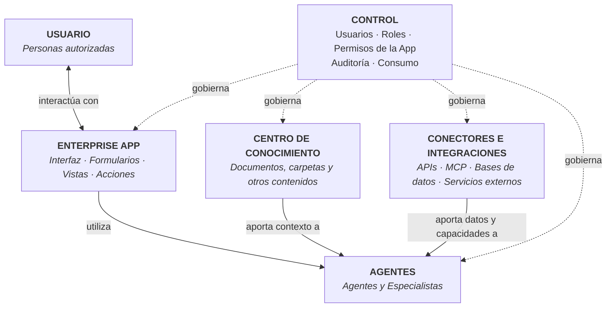
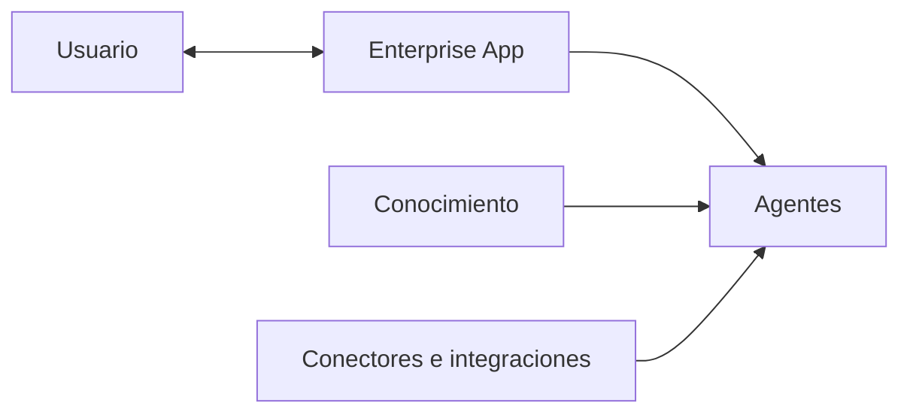

# Apps

## Descripción

Las **Enterprise Apps** permiten construir aplicaciones empresariales que utilizan las capacidades de ConsulPoint dentro de una interfaz específica para cada caso de uso.

A diferencia del modelo de [Conversaciones](/modulos/conversaciones), donde el interlocutor interactúa con un agente a través de un canal de comunicación, en una App el usuario interactúa directamente con una **interfaz de aplicación**, que puede utilizar agentes, conocimiento y conectores de ConsulPoint.

## Arquitectura funcional

La capa de control actúa de forma transversal sobre todos estos elementos.



La **Enterprise App** proporciona la interfaz y la experiencia específica del caso de uso.

Los **agentes** pueden aportar inteligencia a la aplicación para interpretar información, responder, analizar, decidir o ejecutar tareas.

El **conocimiento** proporciona a los agentes información propia de la organización.

Los **conectores e integraciones** permiten consultar información o ejecutar acciones sobre aplicaciones, bases de datos y servicios externos.

El **usuario** interactúa con la aplicación dentro de los permisos que tenga asignados.

La **capa de control** determina qué recursos y capacidades puede utilizar cada aplicación y cada usuario.

Los permisos efectivos de una App dependen de la combinación de los permisos del usuario, los permisos concedidos a la propia aplicación y las políticas establecidas por la organización.

De forma conceptual:

```text
Permisos efectivos =
Permisos del usuario
∩ Permisos de la App
∩ Políticas de la organización
```

Una App no necesita utilizar necesariamente todas las capacidades disponibles. Puede resolver un caso de uso sencillo mediante una interfaz específica o combinar agentes, conocimiento e integraciones cuando el proceso lo requiera.

Como esquema general:



La **capa de control** actúa de forma transversal sobre todos los elementos del sistema.

## Qué permite hacer

ConsulPoint Enterprise Apps permite crear aplicaciones específicas para procesos empresariales utilizando las capacidades comunes de ConsulPoint.

La plataforma permite, entre otras capacidades:

- crear aplicaciones con una interfaz específica para un proceso o necesidad concreta;
- utilizar agentes de inteligencia artificial dentro de una aplicación sin limitar la interacción a una conversación tradicional;
- utilizar conocimiento corporativo como contexto para las funciones de inteligencia artificial de la aplicación;
- conectar las aplicaciones con APIs, MCP, bases de datos y servicios externos;
- consultar información procedente de sistemas corporativos;
- ejecutar acciones sobre sistemas externos cuando la aplicación, el agente y el usuario disponen de los permisos necesarios;
- crear formularios, vistas, herramientas y acciones adaptadas al proceso que se quiere resolver;
- combinar interfaz, inteligencia artificial, conocimiento e integraciones dentro de una única aplicación;
- controlar qué capacidades puede utilizar cada App;
- mantener permisos, auditoría, trazabilidad y control de consumo sobre su utilización.

Las Enterprise Apps permiten utilizar ConsulPoint más allá de la interfaz conversacional.

Mientras que en **Conversaciones** el agente constituye normalmente el centro de la interacción, en **Apps** el usuario trabaja con una aplicación diseñada para una tarea concreta y la inteligencia artificial pasa a formar parte de las capacidades internas de esa aplicación.

El principio general es:

**la App proporciona la experiencia de usuario; ConsulPoint proporciona la inteligencia, el conocimiento, las integraciones y el control.**

:::tip Antes de crear desde cero
Conviene revisar el [Catálogo de Aplicaciones](/organizacion/catalogo-de-aplicaciones) antes de construir una App compleja: es posible que ya exista una equivalente.
:::
