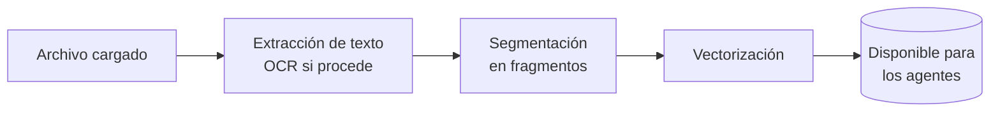

# Centro de Conocimiento

**Ruta:** `/knowledge-hub`

## Descripción

Repositorio documental de la organización. Los archivos que se cargan aquí se procesan, indexan y quedan disponibles para consulta por parte de los agentes.

## Organización del módulo

| Pestaña | Contenido |
|---|---|
| **Mis Documentos** | Contenido propio del usuario |
| **Compartidos conmigo** | Contenido compartido por otros usuarios |

Dispone de vista de **lista** y de **cuadrícula**, con navegación por carpetas mediante ruta de navegación.

## Tipos de carpeta

| Tipo | Función |
|---|---|
| **Estándar** | Almacenamiento documental convencional |
| **Multimedia** | Recursos de audio y vídeo con transcripción y segmentos |
| **ETL** | Carpeta con Extracción Inteligente activada |

## Procesamiento de documentos

Al cargar un archivo, la plataforma ejecuta automáticamente:

1. **Extracción de texto**, con reconocimiento óptico (OCR) en documentos escaneados o basados en imagen.
2. **Segmentación** del contenido en fragmentos.
3. **Vectorización**, que permite la búsqueda por significado y no solo por coincidencia literal.

Este proceso no requiere intervención del usuario. En documentos extensos puede tardar unos minutos.

### Formatos admitidos

Documentos, PDF, hojas de cálculo, presentaciones, imágenes, audio y vídeo. El módulo permite filtrar por estas categorías.

## Recursos multimedia

Los archivos de audio y vídeo se procesan con **transcripción** y división en **segmentos**, quedando su contenido disponible para consulta igual que un documento de texto.

## Compartir contenido

La acción **Compartir** admite tres destinatarios:

| Destinatario | Efecto |
|---|---|
| **Usuarios** | Acceso individual al contenido |
| **Agentes de IA** | Habilita al agente a consultar ese contenido |
| **Espacios de trabajo** | Acceso para todos los miembros del espacio |

:::info Dos rutas, un mismo resultado
Compartir una carpeta con un agente es equivalente a vincularla desde el paso 3 del formulario del [Estudio](/modulos/estudio). Ambas operaciones producen el mismo efecto.
:::

## Extracción Inteligente

Configuración por carpeta que procesa automáticamente cada documento entrante y extrae datos estructurados mediante un agente de IA.

**Componentes:**

| Elemento | Función |
|---|---|
| **Agente de procesamiento** | Agente encargado de la extracción |
| **Estructura JSON** | Formato de los datos a extraer |
| **Aplicación de visualización** | Mini App que presenta los datos extraídos |

El estado de cada documento es visible en la columna **Estado extracción inteligente**.

**Casos de uso:** facturas, albaranes, formularios y documentación recurrente de estructura estable.

## Esquemas de metadatos

**Ruta:** `/knowledge-hub/metadata-schemas`

Permiten definir campos de clasificación propios para los documentos de la organización.

## Acciones disponibles

Compartir · Descargar · Editar · Renombrar · Historial · Ver detalles · Eliminar

## Buenas prácticas

:::tip Organización documental
- Una carpeta por tema, en lugar de una carpeta única con todo el contenido. Facilita la compartición selectiva y la asignación de permisos.
- Prioriza la carga de la documentación más consultada: preguntas frecuentes, catálogos, políticas y manuales.
- Revisa y retira la documentación obsoleta. Un documento desactualizado se reproduce en las respuestas con la misma seguridad que uno vigente.
:::
