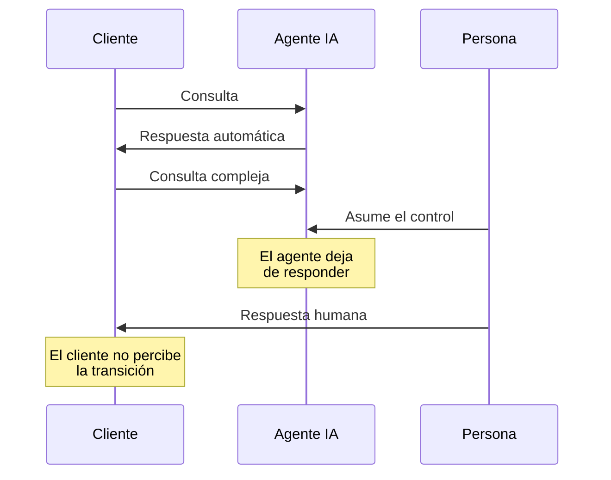

**Ruta:** `/settings/integrations`
**Permiso requerido:** administrador

## Descripción

Configuración de las conexiones con canales de comunicación externos. Una integración vincula un canal con un agente y con un responsable.

## Canales disponibles

| Canal                     | Tipo       | Uso                              |
| ------------------------- | ---------- | -------------------------------- |
| **WhatsApp Business**     | Mensajería | Atención al cliente vía WhatsApp |
| **Telegram**              | Mensajería | Atención vía Telegram            |
| **Gmail**                 | Correo     | Correo corporativo Google        |
| **Microsoft Outlook**     | Correo     | Correo corporativo Microsoft     |
| **IMAP**                  | Correo     | Cualquier servidor de correo     |
| **Aplicaciones externas** | API        | Integración con sistemas propios |

## Estados de integración

| Estado                       | Significado                            |
| ---------------------------- | -------------------------------------- |
| **Activo / Inactivo**        | Integración habilitada o deshabilitada |
| **Conectado / Desconectado** | Estado del canal                       |
| **Autorizado**               | Credenciales válidas                   |
| **Acción requerida**         | Requiere reautorización del usuario    |

:::warning Caducidad de autorizaciones
Las autorizaciones de correo y de WhatsApp caducan. Ante el estado **Acción requerida**, utilizar la acción **Reautorizar cuenta**. El canal no opera mientras persista ese estado — es la causa habitual de que un canal deje de responder sin cambios de configuración.
:::

## Conexión de WhatsApp Business

**Ruta:** `/settings/integrations/whatsapp/new`

Proceso guiado que comienza con la validación de la línea con Meta.

**Requisitos previos:**

- Cuenta de WhatsApp Business
- Número de teléfono no registrado en la aplicación WhatsApp estándar
- Credenciales de Meta

## Conexión de correo

Gmail y Microsoft Outlook se conectan mediante autorización de la cuenta. Otros proveedores requieren datos de servidor IMAP.

## Asignación

Cada integración se configura con:

| Campo                   | Función                                         |
| ----------------------- | ----------------------------------------------- |
| **Agente de IA**        | Agente que atiende el canal                     |
| **Usuario responsable** | Persona a cargo                                 |
| **Equipo**              | Equipo asignado mediante _Gestionar asignación_ |

## Supervisión humana

En cualquier conversación procedente de un canal, un usuario puede asumir el control.

Al asumir el control:

1. El agente deja de responder automáticamente.
2. La persona continúa la conversación.
3. El interlocutor externo no percibe la transición.

:::info Exclusividad garantizada
La plataforma garantiza que **dos usuarios no pueden asumir el control de la misma conversación simultáneamente**.
:::
